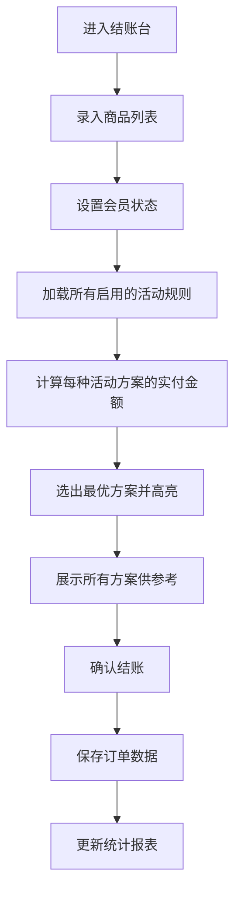

## 1. 产品概述

服装店促销活动管理工具，帮助店主高效管理各类促销活动、自动计算最优优惠方案、统计活动效果数据。
- 目标用户：服装店店主/收银员
- 核心价值：省去人工计算优惠的繁琐，直观掌握活动效果，活动规则可沉淀复用

## 2. 核心功能

### 2.1 功能模块

1. **结账台**：录入商品、选择会员、自动计算最优方案、确认结账
2. **活动管理**：活动规则增删改查、启用/停用、模板保存与导入
3. **数据统计**：活动期间营业额、折扣金额统计、热销商品排行

### 2.2 页面详情

| 页面名称 | 模块名称 | 功能描述 |
|-----------|-------------|---------------------|
| 结账台 | 商品录入区 | 添加商品（名称、单价、数量）、删除商品、清空列表 |
| 结账台 | 会员开关 | 切换是否会员，影响会员折扣计算 |
| 结账台 | 优惠方案展示 | 列出所有可用方案及金额，高亮最优惠方案 |
| 结账台 | 结账确认 | 显示原价、优惠金额、实付金额，确认结账记录 |
| 活动管理 | 活动列表 | 展示所有活动规则，显示状态（启用/停用）、类型 |
| 活动管理 | 活动编辑 | 创建/修改活动（满减、第二件半价、会员折扣、折扣等） |
| 活动管理 | 启停控制 | 一键启用或停用活动规则 |
| 活动管理 | 模板仓库 | 保存活动为模板、从模板创建活动、删除模板 |
| 数据统计 | 概览卡片 | 总营业额、总折扣、订单数、客单价 |
| 数据统计 | 活动效果对比 | 各活动贡献的营业额和折扣金额 |
| 数据统计 | 热销商品 | 参与活动商品的销量排行 |
| 数据统计 | 时间筛选 | 按日期范围筛选统计数据 |

## 3. 核心流程

### 3.1 结账流程
店主录入购买的商品（名称、单价、数量）→ 标记是否会员 → 系统遍历所有启用的活动规则 → 计算每种组合下的实付金额 → 选出最优惠方案展示 → 店主确认结账 → 记录订单数据供统计

### 3.2 活动管理流程
店主进入活动管理 → 创建新活动（选择类型：满减/第二件半价/会员折扣/固定折扣）→ 填写规则参数（如满300减50）→ 保存并启用 → 结账时自动参与计算

## 4. 用户界面设计

### 4.1 设计风格
- **主色调**：玫瑰金系（#E8B4A0 暖粉棕）搭配深墨色（#1A1A2E），营造高端服装店氛围
- **辅助色**：香槟金（#D4AF37）用于强调按钮和关键数据
- **按钮风格**：圆角 8px，带微阴影，悬停时有轻微上浮效果
- **字体**：展示字体用 Lora（优雅衬线），正文字体用 Noto Sans SC（清晰易读）
- **布局风格**：卡片式布局，柔和阴影，分隔清晰
- **图标**：Lucide 图标库，线性风格

### 4.2 页面设计概览

| 页面名称 | 模块名称 | UI元素 |
|-----------|-------------|-------------|
| 结账台 | 商品录入区 | 表单行内布局，每行含名称/单价/数量/删除按钮，底部总价汇总 |
| 结账台 | 方案对比区 | 卡片网格，最优方案边框加粗、金箔色背景、"推荐"标签 |
| 结账台 | 结账区 | 大字号金额展示，确认按钮醒目 |
| 活动管理 | 活动卡片 | 状态标签（绿色启用/灰色停用），类型图标，启停开关按钮 |
| 活动管理 | 编辑弹窗 | 分区表单，根据活动类型动态显示参数项 |
| 数据统计 | 数据卡片 | 大号数字 + 趋势箭头，渐变背景 |
| 数据统计 | 排行榜 | 排名序号徽章 + 商品名 + 销量进度条 |

### 4.3 响应式
桌面优先设计，主内容区宽度 1200px 居中，在平板和手机端自适应为单列布局，确保触摸操作区域足够大。
