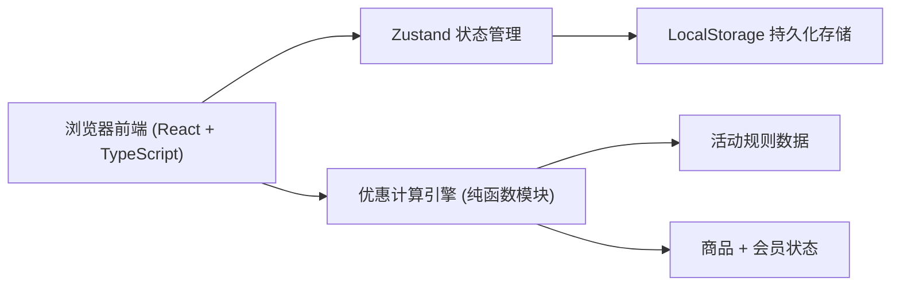
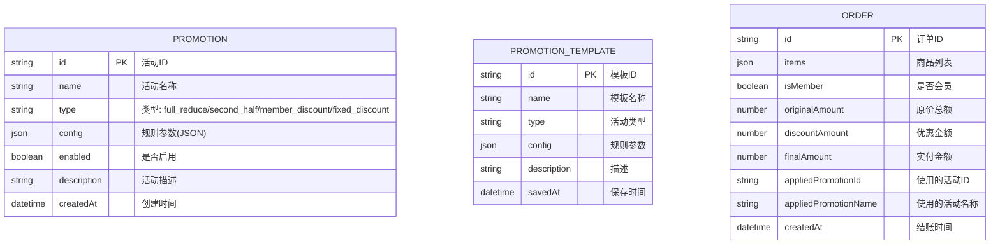

## 1. 架构设计



纯前端架构，数据持久化到浏览器 LocalStorage，无需后端服务。

## 2. 技术描述

- **前端框架**: React 18 + TypeScript
- **构建工具**: Vite 5
- **样式方案**: Tailwind CSS 3
- **状态管理**: Zustand
- **路由**: React Router DOM 6
- **图标库**: Lucide React
- **数据存储**: LocalStorage（封装工具类模拟持久化）
- **初始化方式**: vite-init react-ts 模板

## 3. 路由定义

| 路由 | 页面组件 | 目的 |
|-------|---------|------|
| `/` | Checkout | 结账台首页，默认入口 |
| `/checkout` | Checkout | 结账台：录入商品、计算优惠、结账 |
| `/promotions` | Promotions | 活动管理：规则增删改、启停、模板 |
| `/statistics` | Statistics | 数据统计：营业额、折扣、热销排行 |

## 4. 数据模型

### 4.1 数据模型定义



### 4.2 核心类型定义

```typescript
// 活动类型枚举
type PromotionType = 'full_reduce' | 'second_half' | 'member_discount' | 'fixed_discount';

// 活动规则配置
interface FullReduceConfig {
  threshold: number;    // 满多少
  reduce: number;       // 减多少
  stackable?: boolean;  // 是否可叠加（满600减100）
}

interface SecondHalfConfig {
  applyTo: 'cheapest' | 'same_price'; // 最低价半价 / 同价第二件半价
}

interface MemberDiscountConfig {
  discount: number; // 0-1 如 0.9 表示9折
}

interface FixedDiscountConfig {
  discount: number; // 0-1 如 0.8 表示8折
  threshold?: number; // 可选门槛
}

// 商品项
interface CartItem {
  id: string;
  name: string;
  price: number;
  quantity: number;
}

// 优惠方案
interface DiscountPlan {
  promotionId: string | null;
  promotionName: string;
  originalAmount: number;
  discountAmount: number;
  finalAmount: number;
  breakdown: string[]; // 计算明细
  isBest: boolean;
}

// 订单
interface Order {
  id: string;
  items: CartItem[];
  isMember: boolean;
  originalAmount: number;
  discountAmount: number;
  finalAmount: number;
  appliedPromotionId: string | null;
  appliedPromotionName: string;
  createdAt: string;
}
```

## 5. 核心模块结构

```
src/
├── components/          # 可复用组件
│   ├── Navbar.tsx       # 顶部导航栏
│   ├── StatCard.tsx     # 统计卡片
│   ├── PromotionCard.tsx # 活动卡片
│   └── Modal.tsx        # 通用弹窗
├── pages/               # 页面组件
│   ├── Checkout.tsx     # 结账台
│   ├── Promotions.tsx   # 活动管理
│   └── Statistics.tsx   # 数据统计
├── store/               # Zustand 状态
│   └── useStore.ts      # 全局状态（活动、订单、购物车）
├── utils/
│   ├── discountEngine.ts # 优惠计算引擎核心
│   ├── storage.ts        # LocalStorage 封装
│   └── format.ts         # 格式化工具
├── types/
│   └── index.ts          # 类型定义
├── App.tsx
├── main.tsx
└── index.css
```
